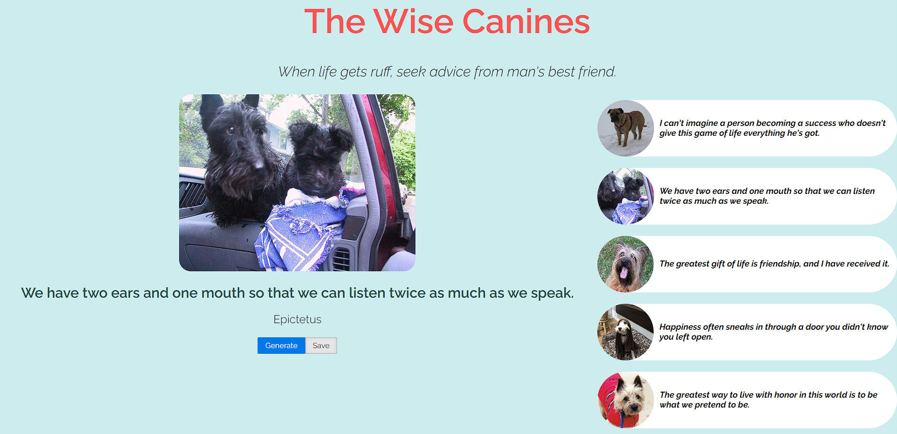

# The Wise Canines

## Description

This application is to amuse and inspire the user by providing the user with a random inspiring quote from a notable person in conjuction with a wholesome image of a dog.
Additionally, the user is able to save up to five dog images and inspiring quote combinations for later use in their search of upliftment.

## Installation

There is no installation involved for the user. Just follow this link:

https://sjgresha.github.io/Project-1-Random-Quotes/

## Usage

When using the application, the user will click the generate button in order to generate an inspiring quote as well as an image of a dog. If the user likes the quote as well as the image of the dog, the user can click the save button to save it and view it for later. If the user would like to reload the saved image and quote, they can click the saved quote box to the right of the page. 

## Credits

The following project was created by:

Andrew Roper - https://github.com/Hello-AndyJoe

Steven Gresham - https://github.com/sjgresha

Challenge Gomez - https://github.com/clgomez5

The following API's were used in assistance to create the application:

https://dog.ceo/dog-api/

https://github.com/lukePeavey/quotable accessed as https://api.quotable.io/

Font provided by Google Fonts as Designed by Matt McInerney, Pablo Impallari, Rodrigo Fuenzalida https://fonts.google.com/specimen/Raleway